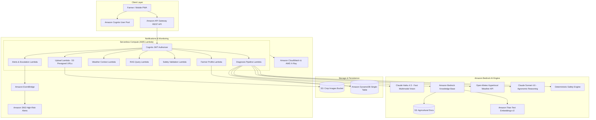

# AgroCare AI — AWS-Native Agricultural Intelligence Platform

> **Grounded, multimodal crop disease intelligence and weather-aware decision support designed specifically for Indian farmers.**

[](https://aws.amazon.com/)
[](https://aws.amazon.com/bedrock/)
[](https://www.anthropic.com/)
[](https://reactjs.org/)
[](LICENSE)

---

## Problem

Indian smallholder farmers lose **20–40% of their crop yield annually** to pests, fungal pathogens, and nutrient deficiencies. Conventional advisory channels suffer from:
1. **Unverifiable AI Hallucinations:** Chatbots and generic vision tools suggest ungrounded or prohibited chemical treatments.
2. **Weather Disconnect:** Recommending pesticide or fertilizer spraying hours before torrential monsoonal rains leads to chemical runoff, ground contamination, and wasted investment.
3. **Absence of Grounded Agronomic Evidence:** Advice lacks backing from verified agricultural institutions (ICAR, CPCRI, KAU).
4. **Safety & Dosage Hazards:** Over-concentration or chemical mismatches harm crops and endanger soil ecology.

---

## Solution

**AgroCare AI** is an AWS-native, production-deployed agricultural intelligence platform. It replaces generic chatbot responses with a **6-stage deterministic diagnostic pipeline**:
- **Dual-Model Vision & Reasoning:** Claude Haiku 4.5 performs rapid visual pathology extraction; Claude Sonnet 4.6 generates agronomic intervention plans.
- **Bedrock Knowledge Base RAG:** All recommendations are retrieved and cited directly from official Indian agronomy literature (ICAR bulletins, CPCRI manuals).
- **Live Weather Feasibility:** Real-time Open-Meteo telemetry calculates spray-window viability and warns against upcoming rain or high heat.
- **Deterministic Safety Layer:** Hardcoded safety gates enforce `ALLOW`, `MODIFY`, `BLOCK`, `DEFER`, or `ESCALATE` decisions before any recommendation reaches the farmer.
- **Multi-Tenant Security:** Cognito JWT authorizer with tenant-isolated DynamoDB single-table design.

---

## Core Workflow

```
   OBSERVE
   Farmer captures leaf photo + inputs crop, location, growth stage & symptoms
      ↓
   UNDERSTAND
   Claude Haiku 4.5 extracts structured visual pathology & identifies knowledge gaps
      ↓
   RETRIEVE
   Bedrock Knowledge Base (Titan Text Embeddings v2) fetches grounded ICAR/CPCRI citations
      ↓
   ENRICH
   Live hyperlocal weather fetched to evaluate ambient spray-window safety
      ↓
   REASON
   Claude Sonnet 4.6 synthesizes diagnosis, treatment plan, and precautions
      ↓
   VALIDATE
   Deterministic Safety Engine enforces safety policy (Allow/Modify/Block/Defer/Escalate)
      ↓
   ACT & FOLLOW UP
   Farmer receives actionable guidance with sources, and record is persisted in DynamoDB
```

---

## Architecture



---

## Key Features

- **Multimodal Visual Pathology:** Analyzes leaf damage, necrotic lesions, chlorosis, and rust with bounding-box observations.
- **RAG with Verifiable Citations:** Returns exact publication title, section, and confidence score for each recommendation.
- **Weather-Aware Spray Advisory:** Automatically defers chemical spray actions if rain is expected within 3 hours or wind speed exceeds threshold.
- **Deterministic 6-Point Safety Engine:**
  - *Check 1:* Missing crop or location data
  - *Check 2:* Unverified/low-confidence diagnoses
  - *Check 3:* Extreme ambient heat (>45°C) or freezing conditions
  - *Check 4:* Spraying during rain window (deferred)
  - *Check 5:* Chemical pesticide misuse on organic-designated crops (modified)
  - *Check 6:* Conflicting or insufficient knowledge-base citations (escalated to human agronomist)
- **Multi-Tenant Profile & History:** Securely tracks past farmer diagnoses, location history, and follow-up schedules.
- **Offline & High-Contrast PWA UI:** Large 48px touch targets, mobile-first design, high contrast for bright outdoor sunlight.

---

## Deployed AWS Stack (`ap-south-1`)

The production stack is deployed and active in **ap-south-1 (Mumbai)**:

| Resource | Deployed Identifier |
|---|---|
| **CloudFormation Stack** | `agrocare-ai-dev` (Status: `UPDATE_COMPLETE`) |
| **API Gateway URL** | `https://cswuh02bdi.execute-api.ap-south-1.amazonaws.com/dev` |
| **Cognito User Pool** | `ap-south-1_ID0rVVP3m` |
| **Cognito App Client** | `66o85ou4840kptkt9kmibb10li` |
| **DynamoDB Single Table** | `AgroCare-Main-dev` |
| **S3 Crop Images Bucket** | `agrocare-crop-images-dev-570380297278` |
| **S3 Agri Docs Bucket** | `agrocare-agri-docs-dev-570380297278` |
| **SNS Alert Topic** | `arn:aws:sns:ap-south-1:570380297278:agrocare-alerts-dev` |
| **Primary Vision Model** | `global.anthropic.claude-haiku-4-5-20251001-v1:0` |
| **Reasoning Model** | `anthropic.claude-sonnet-4-6` |
| **Embeddings Model** | `amazon.titan-embed-text-v2:0` |

---

## API Routes

All endpoints are authenticated via Cognito JWT Bearer token:

| Method | Route | Description |
|---|---|---|
| `GET` | `/upload/presigned` | Generates S3 virtual-hosted presigned PUT URL |
| `POST` | `/diagnosis` | Executes full 6-stage multimodal diagnosis pipeline |
| `GET` | `/diagnosis/{id}` | Retrieves diagnosis record and safety validation |
| `GET` | `/diagnosis/history` | Fetches paginated farmer diagnosis history |
| `GET` | `/weather` | Hyperlocal temperature, humidity, spray advisory |
| `POST` | `/recommendation/validate`| Standalone deterministic safety engine validation |
| `POST` | `/agriculture/query` | RAG query over ICAR/CPCRI agronomy documentation |
| `GET/PUT` | `/profile` | Farmer farm profile and primary crops |
| `GET` | `/profile/farms` | Farm locations and acreage |

---

## Local Development & Testing

### 1. Backend Testing
```bash
# Set PYTHONPATH and run 50 unit tests with pytest
python -m pytest backend/tests -v
```

### 2. Frontend Development & Vitest
```bash
cd frontend

# Run typecheck
npm run typecheck

# Run Vitest test suite (28 tests)
npm run test

# Build production bundle
npm run build

# Start local preview
npm run dev
```

---

## Verification Evidence

- **Unit Test Coverage:** 50/50 backend unit tests passing; 28/28 frontend component tests passing.
- **Production End-to-End Test:** Verified against live AWS infrastructure in `ap-south-1` across authentication, S3 presigned upload, weather telemetry, safety validation, DynamoDB persistence, and multi-tenant isolation.
- Detailed test state documented in [`docs/PROD_TEST_STATE.md`](docs/PROD_TEST_STATE.md).

---

## License

This project is licensed under the MIT License — see the [LICENSE](LICENSE) file for details.
