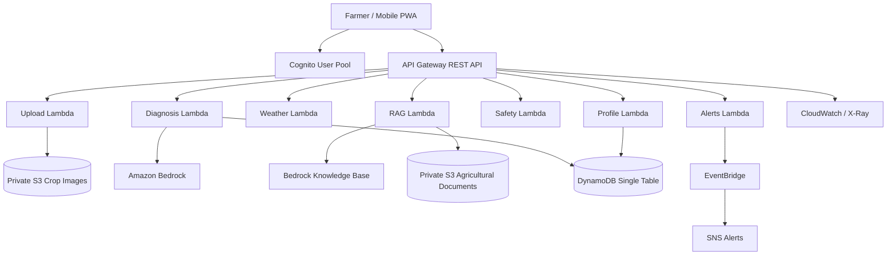

# AgroCare AI

> AWS-native, evidence-grounded agricultural intelligence for Indian smallholder farmers.

[](https://aws.amazon.com/)
[](https://react.dev/)
[](https://www.typescriptlang.org/)
[](LICENSE)

AgroCare AI helps farmers turn a crop photo, local weather, and farm context into practical next steps. It combines multimodal diagnosis, agronomic retrieval, weather-aware recommendations, deterministic safety checks, and user-scoped history in a mobile-first progressive web application.

This AWS-native edition is the production-oriented evolution of the earlier AgroCare, KisanAI, AgriSmart AI, and AgroVision AI workspaces. It carries forward the original farmer-first priorities: voice and language accessibility, offline-aware workflows, mandi intelligence, supplier discovery, soil and fertilizer guidance, and clear explanations instead of opaque AI output.

## Why AgroCare AI exists

Smallholder farmers often face four connected problems:

1. Crop symptoms are identified too late or without reliable evidence.
2. Generic advice ignores local weather and spray-window risk.
3. Recommendations may be ungrounded, unsafe, or difficult to verify.
4. Language, literacy, connectivity, and market-information barriers limit access to expert support.

AgroCare AI addresses these issues with a guarded workflow that separates observation, retrieval, reasoning, and safety validation before advice reaches the user.

## Core workflow

```text
Farmer captures a crop image and provides crop/location context
        |
        v
Upload Lambda -> private S3 crop-image bucket
        |
        v
Diagnosis Lambda -> Claude Haiku multimodal analysis
        |
        v
RAG Lambda -> Bedrock Knowledge Base and agricultural sources
        |
        v
Weather Lambda -> local forecast and spray-window context
        |
        v
Claude Sonnet agronomic reasoning
        |
        v
Deterministic Safety Lambda -> ALLOW / MODIFY / BLOCK / DEFER / ESCALATE
        |
        v
DynamoDB persistence -> API response -> farmer-facing result and history
```

When Bedrock account authorization is unavailable, the pipeline returns a structured, safe error or escalation state rather than fabricating a diagnosis.

## Product capabilities

- **Multimodal crop diagnosis:** Analyze leaf damage, lesions, chlorosis, rust, pests, and nutrient symptoms.
- **Evidence-grounded recommendations:** Retrieve relevant ICAR, CPCRI, KAU, and other agricultural guidance through RAG.
- **Weather-aware spray advice:** Defer or modify actions when rain, wind, or temperature makes treatment unsafe.
- **Deterministic safety engine:** Apply explicit checks for missing context, low confidence, extreme weather, chemical misuse, and insufficient evidence.
- **Farmer history and profiles:** Persist diagnoses, farms, crops, and follow-up information with tenant-scoped access.
- **Voice-first accessibility:** Extend the earlier AgroCare voice assistant and speech-oriented workflows for users who prefer spoken interaction.
- **Localization:** Support the multilingual direction established by the earlier AgroCare workspace, including English, Hindi, Kannada, Marathi, Tamil, and Telugu content surfaces where implemented.
- **Market intelligence:** Preserve the earlier mandi-price and arbitrage-analysis direction for comparing sale opportunities and transport costs.
- **Supplier and input discovery:** Support nearby agricultural suppliers, fertilizer information, and compatibility guidance.
- **Offline-aware PWA experience:** Maintain a usable high-contrast mobile interface for rural and low-connectivity contexts.

## AWS architecture



The infrastructure is defined in `infrastructure/template.yaml` and is designed for `ap-south-1`.

### Deployed service responsibilities

| Service | Responsibility |
| --- | --- |
| Amazon Cognito | Farmer authentication and JWT issuance |
| API Gateway | Authenticated REST API surface and request routing |
| AWS Lambda | Upload, diagnosis, RAG, weather, profile, safety, and alert workflows |
| Amazon S3 | Private crop images and agricultural reference documents |
| Amazon Bedrock | Multimodal analysis, agronomic reasoning, embeddings, and retrieval |
| DynamoDB | Farmer-scoped single-table persistence and history |
| EventBridge + SNS | High-risk diagnosis alert routing |
| CloudWatch + X-Ray | Logs, alarms, tracing, and operational visibility |

## Repository structure

```text
backend/
  functions/              Lambda handlers and function-local shared modules
  layer/                  Shared Python Lambda layer
  tests/                  Unit and integration tests
frontend/
  src/                    React pages, UI components, API client, and auth context
  tests/                  Component and behavior tests
documents/                Seed agronomy, crop, fertilizer, and indigenous-knowledge material
infrastructure/
  template.yaml           AWS SAM/CloudFormation infrastructure
  samconfig.toml          Deployment configuration
  scripts/                Document ingestion and operational helpers
docs/                     Deployment and production-verification evidence
Makefile                  Build, test, validation, deployment, and operations commands
```

## Local development

### Prerequisites

- Python 3.12 or newer
- `uv` or a Python virtual environment
- Node.js 18 or newer and npm
- AWS CLI and AWS SAM CLI
- AWS credentials with access to the target account and `ap-south-1`

Install dependencies:

```bash
make install
make frontend-install
```

Configure backend values from the example files without committing secrets:

```bash
cp backend/.env.example backend/.env
cp frontend/.env.example frontend/.env.local
```

Start the frontend:

```bash
make frontend-dev
```

The frontend API base URL should point to the API Gateway stage emitted by the CloudFormation stack. Cognito identifiers should come from stack outputs or the local environment file, never from hardcoded secrets.

## Validation, tests, and builds

```bash
make validate
make test-unit
make frontend-build
make test
```

Integration tests require a deployed environment and valid test credentials:

```bash
make test-integration
```

The test suites cover authentication, schemas, upload validation, safety decisions, RAG routing, and frontend states. Production verification is documented in [`docs/PROD_TEST_STATE.md`](docs/PROD_TEST_STATE.md) and deployment history in [`docs/DEPLOY_STATE.md`](docs/DEPLOY_STATE.md).

## Deployment

Deploy only to the configured region, `ap-south-1`:

```bash
make validate
make build
make deploy
```

The deployment uses the existing stack name for the selected environment, defaults to `agrocare-ai-dev`, and requires the appropriate IAM capabilities. Review the change set and CloudFormation events when deploying a new environment.

Seed the agricultural reference documents after the storage and permissions are ready:

```bash
make upload-docs
```

The Knowledge Base must be created and ingestion must complete before RAG-backed recommendations can be considered fully operational.

## API surface

All protected routes require a Cognito JWT bearer token.

| Method | Route | Purpose |
| --- | --- | --- |
| `GET` | `/upload/presigned` | Create a presigned crop-image upload URL |
| `POST` | `/diagnosis` | Run the diagnosis workflow |
| `GET` | `/diagnosis/{id}` | Retrieve a diagnosis record |
| `GET` | `/diagnosis/history` | List farmer-scoped history |
| `GET` | `/weather` | Get weather and spray-window context |
| `POST` | `/agriculture/query` | Query grounded agricultural knowledge |
| `POST` | `/recommendation/validate` | Run deterministic safety validation |
| `GET`, `PUT` | `/profile` | Read or update farmer profile |
| `GET`, `POST` | `/profile/farms` | Read or create farm records |

## Safety and security principles

- Farmer identity is derived from verified Cognito claims, not caller-supplied IDs.
- S3 buckets remain private; image access uses scoped presigned URLs.
- DynamoDB records are partitioned by farmer identity.
- Uploads are validated for required fields, size, MIME type, and object-key scope.
- Safety validation remains deterministic and cannot be bypassed by model output.
- Low-confidence, missing-context, unsafe-weather, or insufficient-evidence cases escalate instead of producing unsupported treatment advice.
- Secrets, tokens, passwords, and service-account JSON must never be committed or emitted in logs.

## Operational status

The AWS infrastructure and API routes are deployed through CloudFormation in `ap-south-1`. The production verification evidence confirms authentication, presigned upload, weather, safety routing, persistence, and tenant-isolation paths.

At the time of the latest verification, Amazon Bedrock generative-model access was blocked by account-level authorization/verification. The application handles this condition as a structured `AI_ERROR` or `ESCALATE` response; it is not resolved by code changes or IAM broadening and requires an AWS Support/account-authorization action.

Treat a successful CloudFormation update or frontend build as necessary but insufficient. A release is complete only after an authenticated live request, storage confirmation, safety result, persistence check, and CloudWatch review succeed.

## Further documentation

- [Deployment state](docs/DEPLOY_STATE.md)
- [Production test state](docs/PROD_TEST_STATE.md)
- [Infrastructure template](infrastructure/template.yaml)
- [Makefile commands](Makefile)

## License

This project is licensed under the MIT License. See [LICENSE](LICENSE).
